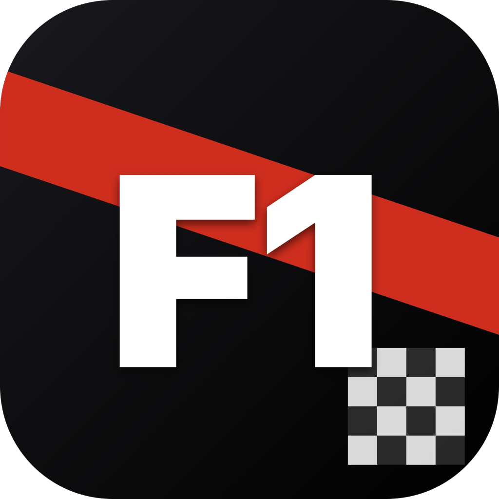

# F1 Widget for macOS

<p align="center">
  
</p>

A minimal F1 dashboard + desktop widgets for macOS. Shows the next Grand Prix, full session schedule in your local time, driver and constructor standings, and per-race Race/Qualifying/Sprint results. Built natively with SwiftUI + WidgetKit. Data from the [jolpica-f1 API](https://github.com/jolpica/jolpica-f1) (Ergast-compatible). Track outlines come from the [bacinger/f1-circuits](https://github.com/bacinger/f1-circuits) MIT-licensed GeoJSON dataset.


## Features

### Host app
- **Schedule tab** — Hero card with country gradient, satellite Map (MapKit) + accurate track outline rendered from GeoJSON, full session list and live countdown to the next session.
- **Results tab** — Every completed race of the current season; tap a card to load Race / Qualifying / Sprint results on demand. Gold / silver / bronze pills for top-3 finishers, real team color stripes.
- **Standings tab** — WDC and WCC tables with real team logos.

### Desktop widgets (Small / Medium / Large)
- **Small** — flag + Round chip + GP name + track outline + live countdown.
- **Medium** — two-column layout: track outline on the left, session times on the right + next-session countdown.
- **Large** — full dashboard: track + sessions + WDC top 5 with team logos.

## Requirements

- macOS 26.3 or later
- Apple Silicon or Intel (universal binary)

## Install

1. Download `F1Widget.dmg` from the latest [release](../../releases).
2. Open the DMG and drag **F1Widget** onto the **Applications** shortcut.
3. Eject the DMG.

### First launch (important)

This app is **not signed with an Apple Developer ID** (adhoc-signed). macOS will refuse to open it by default. Use one of:

**Option 1 — Terminal (fastest):**

```bash
xattr -dr com.apple.quarantine /Applications/F1Widget.app
```

**Option 2 — System Settings:**

1. Double-click F1Widget once and dismiss the warning.
2. Open **System Settings → Privacy & Security**.
3. Scroll to **Security**, click **Open Anyway** next to *"F1Widget was blocked from use"*.

### Add the widget

1. Run F1Widget once, then quit it (⌘Q).
2. Right-click the Desktop → **Edit Widgets** (or click the menu-bar date/time → Edit Widgets).
3. Search **F1**. Drag *F1 Schedule* (Small / Medium / Large) onto the Desktop.

If the widget doesn't appear, run in Terminal:

```bash
killall chronod && killall NotificationCenter
```

## Build from source

Open `F1Widget.xcodeproj` in Xcode (26.3+). Both targets (`F1Widget` and `F1WidgetExtension`) must have **App Sandbox → Outgoing Connections (Client)** enabled for network access.

## Privacy

- The app fetches public F1 schedule and standings data from `api.jolpi.ca` and track GeoJSON from `raw.githubusercontent.com`.
- Team logos and the satellite map are loaded from local bundled assets / Apple Maps.
- No analytics, no tracking, no accounts.

## Credits

- F1 schedule and results data: [jolpica-f1](https://github.com/jolpica/jolpica-f1)
- Circuit outlines: [bacinger/f1-circuits](https://github.com/bacinger/f1-circuits) (MIT)
- Team logos: formula1.com (Mercedes, Ferrari, Red Bull, McLaren, Aston Martin, Alpine, Williams, Haas, Kick Sauber, Racing Bulls) and Wikimedia Commons (Audi, Cadillac F1 Team).
- Built with SwiftUI, WidgetKit and MapKit.

## License

MIT — see [LICENSE](LICENSE).
